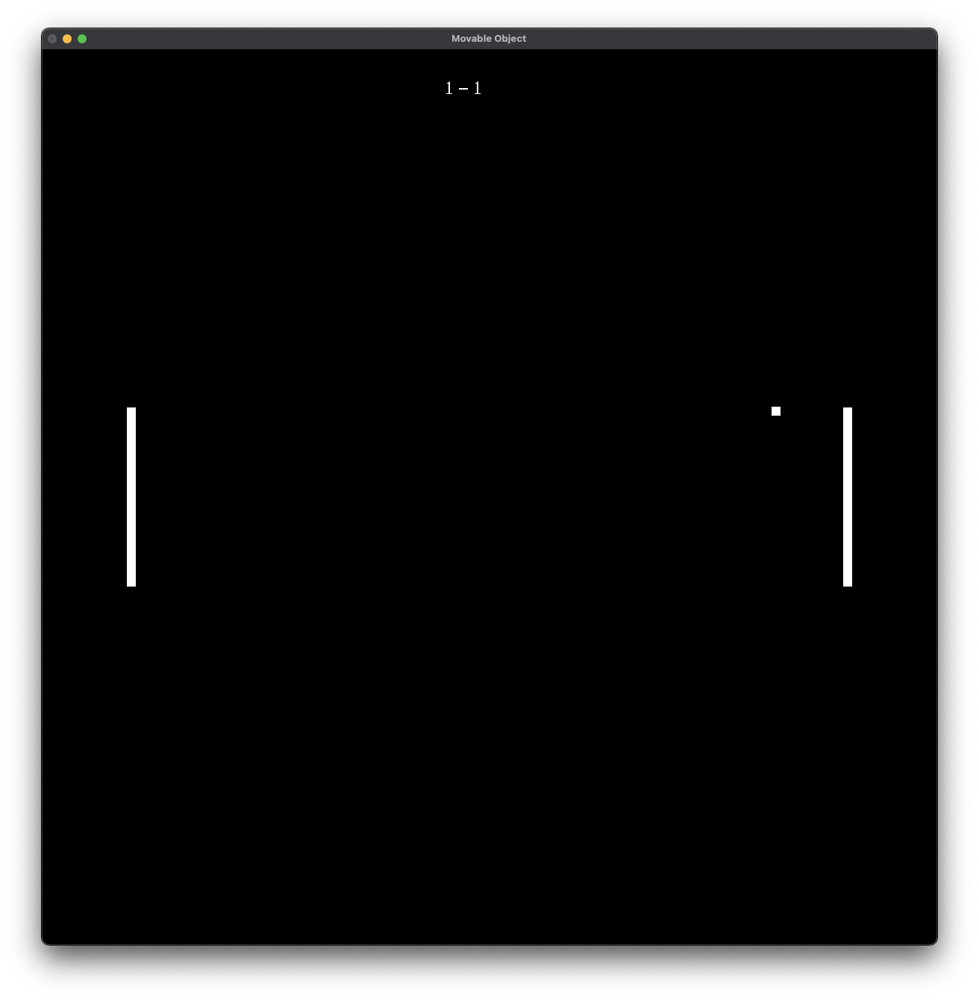

# CS-Independent-Study

Holds the files for the projects I created in my OpenGL CS independent study from fall 2019. All projects have been tested to properly run on Xcode Version 11.2.1. In order for projects to run properly OpenGL and Glut must be installed. Also in the Xcode project under Build Phases--->Link Binary with Libraries, must include GLUT.framwork and OpenGL.framework.

## Key Projects Screenshots

### Mario 1-1

### Pong

